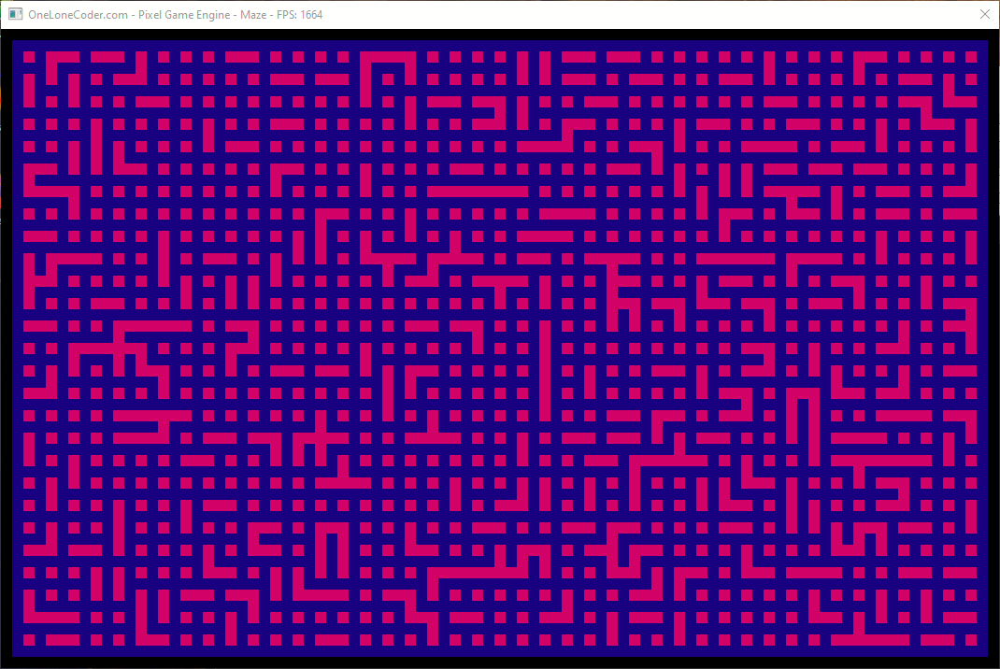
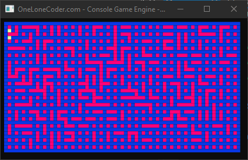

# Maze Generator by unionning graphs

## Results

### Latest (2024)



### Previously (2022)



## Install

Make sure you have git and CMake installed

Cloning a Project with Submodules using **--recurse-submodules**:

```
git clone --recurse-submodules https://github.com/victor-mlai/MazeGenerator_graphsUnioning.git
```

Then either use CMake GUI + IDE or these commands to Generate, Build and Run the project:

```
cd MazeGenerator_graphsUnioning
cmake -S . -B .build
cmake --build .build --config Release
./.build/Release/maze_gen
```

In Main.cpp you can change the rows, cols, cellSize. And in MazeView.hpp the colours.

While running, use Esc to stop the window anytime.

## Algorithm explained

Used OneLoneCoder's PixelGameEngine to draw the maze.

Main.cpp creates 2 threads: one that draws the maze and
one that creates it and then solves it.

MazeCreator.hpp contains the algorithm for Generating the maze:

* Considering this "maze under construction" where each square is a graph
that contains exactly 1 node.

```
1 2 3 4 5 6 7 8 9 ..    13
+---+---+---+---+---+---+ 1
| - | - | - | - | - | - | 2
+---+---+---+---+---+---+ 3 
| - | - | - | - | - | - | 4
+---+---+---+---+---+---+ 5
| - | - | - | - | - | - | 6
+---+---+---+---+---+---+ 7
| - | - | - | - | - | - | .
+---+---+---+---+---+---+ .
| - | - | - | - | - | - | .
+---+---+---+---+---+---+ .
| - | - | - | - | - | - | .
+---+---+---+---+---+---+ 13
```

We choose randomly 2 adiacent nodes from 2 different graphs and unite them.

```
1 2 3 4 5 6 7 8 9 ..    13
+---+---+---+---+---+---+ 1
| - | - | - | - | - | - | 2
+---+---+---+---+---+---+ 3 
| - | - | - | - | - | - | 4
+---+---+---+---+---+---+ 5
| - | - |       | - | - | 6
+---+---+---+---+---+---+ 7
| - | - | - | - | - | - | .
+---+---+---+---+---+---+ .
| - | - | - | - | - | - | .
+---+---+---+---+---+---+ .
| - | - | - | - | - | - | .
+---+---+---+---+---+---+ 13
```

And repeat until there is only one graph

```
1 2 3 4 5 6 7 8 9 ..    13	   1 2 3 4 5 6 7 8 9 ..    13	
+---+---+---+---+---+---+ 1	   +---+---+---+---+---+---+ 1	
| - | - | - | - | - | - | 2	   | - | - | - | - | - | - | 2	
+---+---+---+---+---+---+ 3   	   +---+---+---+---+---+---+ 3 	
| - | - | - | - | - | - | 4	   | - | - | - | - | - | - | 4	
+---+---+---+---+---+---+ 5	   +---+---+---+---+---+---+ 5	
| - | - |       | - | - | 6	   | - | - |       | - | - | 6	
+---+---+---+---+---+---+ 7	   +---+---+   +---+---+---+ 7	
| - | - | - | - |   | - | .  	   | - | - |   | - |   | - | .  
+---+---+---+---+   +---+ .	   +---+---+---+---+   +---+ .	
| - | - | - | - |   | - | .	   | - | - | - | - |   | - | .	
+---+---+---+---+---+---+ .	   +---+---+---+---+---+---+ .	
| - | - | - | - | - | - | .	   | - | - | - | - | - | - | .	
+---+---+---+---+---+---+ 13  	   +---+---+---+---+---+---+ 13 

1 2 3 4 5 6 7 8 9 ..    13	   1 2 3 4 5 6 7 8 9 ..    13
+---+---+---+---+---+---+ 1	   +---+---+---+---+---+---+ 1
| - |       | - | - | - | 2	   | - |       | - | - | - | 2
+---+---+---+---+---+---+ 3    	   +---+---+   +---+---+---+ 3 
| - | - | - | - | - | - | 4	   | - | - |   | - | - | - | 4
+---+---+---+---+---+---+ 5	   +---+---+   +---+---+---+ 5
| - | - |       | - | - | 6	   | - | - |       | - | - | 6
+---+---+   +---+---+---+ 7	   +---+---+   +---+---+---+ 7
| - | - |   | - |   | - | .	   | - | - |   | - |   | - | .
+---+---+---+---+   +---+ .	   +---+---+---+---+   +---+ .
| - | - | - | - |   | - | .	   | - | - | - | - |   | - | .
+---+---+---+---+---+---+ .	   +---+---+---+---+---+---+ .
| - | - | - | - | - | - | .	   | - | - | - | - | - | - | .
+---+---+---+---+---+---+ 13 	   +---+---+---+---+---+---+ 13

.
.
.

1 2 3 4 5 6 7 8 9 ..    13
+---+---+---+---+---+---+ 1
|   |       |           | 2
+   +---+   +   +   +---+ 3
|           |   |       | 4
+---+---+   +---+---+   + 5
|       |           |   | 6
+   +---+   +   +---+   + 7
|           |           | 8
+   +---+---+---+   +---+ 9
|       |       |       | 10
+   +---+   +---+   +---+ 11
|       |               | 12
+---+---+---+---+---+---+ 13
```

And then, in MazeSolver.hpp, we solve it using bfs with prioritised direction:

```
1 2 3 4 5 6 7 8 9 ..    13
+---+---+---+---+---+---+ 1
|   |       |     >   >   2
+   +---+   +   +   +---+ 3
|           |   | ^   < | 4
+---+---+   +---+---+   + 5
|       | >   v     | ^ | 6
+   +---+   +   +---+   + 7
| >   >   ^ | >   >   ^ | 8
+   +---+---+---+   +---+ 9
| ^     |       |       | 10
+   +---+   +---+   +---+ 11
  ^     |               | 12
+---+---+---+---+---+---+ 13
```
E.g.: if the exit is Top Right corner and it has to choose between going
Left or Right, it will choose going Right because it's closer to the exit.
